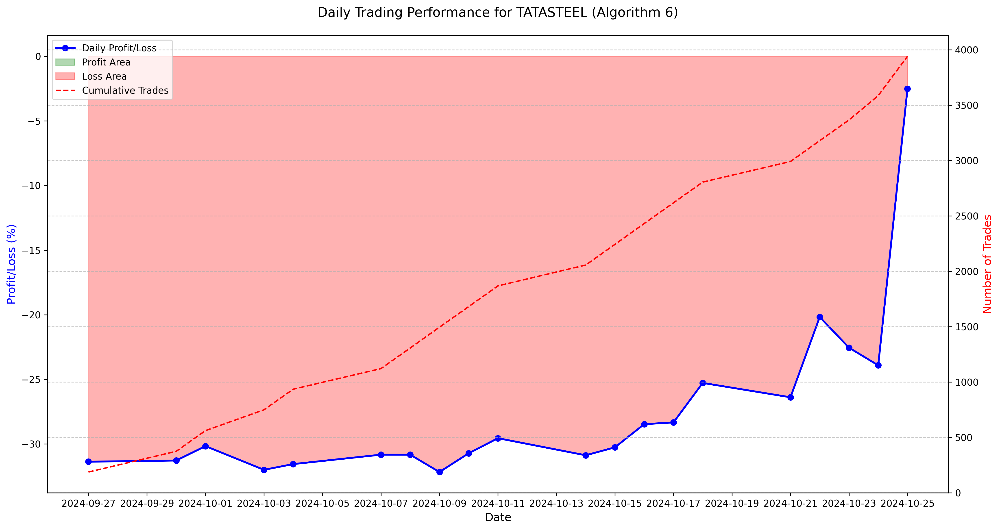

# AI Algorithmic Trading System

This project leverages AI-driven multi-agent architecture to develop, test, and refine algorithmic trading strategies for the Indian stock market. It uses technical indicators and historical data to generate, backtest, and evaluate trading algorithms in an iterative process that fine-tunes strategies until the target performance criteria are met. A local instance of the Ollama model is used to generate and improve trading algorithms based on performance feedback.

## Table of Contents

1. [Project Overview](#project-overview)
2. [Project Structure](#project-structure)
3. [Installation](#installation)
4. [Usage](#usage)
5. [Configuration](#configuration)
6. [Agent Workflow](#agent-workflow)
7. [Outputs](#outputs)
8. [Contributing](#contributing)
9. [License](#license)

---

## Project Overview

This system automates the generation, backtesting, and optimization of trading algorithms for Indian stocks using various technical indicators. The system iteratively improves algorithmic performance by evaluating outcomes and retraining the Ollama model when criteria are unmet. Key features include:

- **Automated Algorithm Generation**: Uses the Ollama model to create unique buy/sell conditions for stock trading.
- **Backtesting with Historical Data**: Tests algorithms on past stock data to assess profitability.
- **Automated Feedback and Improvement**: Refines the Ollama model based on performance feedback.

## Sample Output

Below is an example of a performance graph for the TATASTEEL algorithm (Algorithm 6). The graph shows the profit/loss over time from the backtesting results.



The graph illustrates the cumulative profit/loss over time, with positive values indicating profit and negative values indicating loss. The algorithm's performance is evaluated based on this graph, and the Ollama model is retrained to improve the algorithm's performance if necessary.

## Final Output

Algorithm -
Buy Conditions:
- **; - 1. rsi(14) < 30; - 2. ema(20) > ema(50); - 3. bollinger band lower (sma(20), 2) > price; - 4. obv > volume * 0.5

Sell Conditions:
- **; - 1. rsi(14) > 70; - 2. sma(20) < sma(50); - 3. ema(20) < ema(50); - 4. vwap(20) > price

Daily Results:
	2024-10-25 Profit: -2.52% ; total trade: 355 ; buy_trade - 15 ; sell_trade - 0
	2024-10-24 Profit: -23.92% ; total trade: 220 ; buy_trade - 152 ; sell_trade - 0
	2024-10-23 Profit: -22.55% ; total trade: 187 ; buy_trade - 189 ; sell_trade - 0
	2024-10-22 Profit: -20.18% ; total trade: 188 ; buy_trade - 188 ; sell_trade - 0
	2024-10-21 Profit: -26.39% ; total trade: 186 ; buy_trade - 188 ; sell_trade - 0
	2024-10-18 Profit: -25.28% ; total trade: 187 ; buy_trade - 188 ; sell_trade - 0
	2024-10-17 Profit: -28.34% ; total trade: 187 ; buy_trade - 188 ; sell_trade - 0
	2024-10-16 Profit: -28.47% ; total trade: 188 ; buy_trade - 188 ; sell_trade - 0
	2024-10-15 Profit: -30.26% ; total trade: 187 ; buy_trade - 189 ; sell_trade - 0
	2024-10-14 Profit: -30.88% ; total trade: 188 ; buy_trade - 188 ; sell_trade - 0
	2024-10-11 Profit: -29.56% ; total trade: 187 ; buy_trade - 188 ; sell_trade - 0
	2024-10-10 Profit: -30.72% ; total trade: 186 ; buy_trade - 188 ; sell_trade - 0
	2024-10-09 Profit: -32.18% ; total trade: 188 ; buy_trade - 188 ; sell_trade - 0
	2024-10-08 Profit: -30.83% ; total trade: 186 ; buy_trade - 188 ; sell_trade - 0
	2024-10-07 Profit: -30.83% ; total trade: 186 ; buy_trade - 187 ; sell_trade - 0
	2024-10-04 Profit: -31.56% ; total trade: 186 ; buy_trade - 187 ; sell_trade - 0
	2024-10-03 Profit: -32.00% ; total trade: 188 ; buy_trade - 188 ; sell_trade - 0
	2024-10-01 Profit: -30.17% ; total trade: 187 ; buy_trade - 189 ; sell_trade - 0
	2024-09-30 Profit: -31.28% ; total trade: 187 ; buy_trade - 188 ; sell_trade - 0
	2024-09-27 Profit: -31.38% ; total trade: 187 ; buy_trade - 187 ; sell_trade - 0

Overall Statistics:
Start: 2024-09-27 09:15:00+05:30
End: 2024-10-25 15:29:00+05:30
Duration: 28 days 06:14:00
Exposure Time [%]: 94.53
Equity Final [$]: 145.08
Equity Peak [$]: 100000.00
Return [%]: -99.85
Buy & Hold Return [%]: -12.88
Return (Ann.) [%]: -100.00
Volatility (Ann.) [%]: 0.00
Sharpe Ratio: 0.00
Sortino Ratio: 0.00
Calmar Ratio: 0.00
Max. Drawdown [%]: -99.86
Avg. Drawdown [%]: -99.86
Max. Drawdown Duration: 28 days 06:13:00
Avg. Drawdown Duration: 28 days 06:13:00
# Trades: 3533
Win Rate [%]: 1.92
Best Trade [%]: 0.77
Worst Trade [%]: -2.86
Avg. Trade [%]: -0.20
Max. Trade Duration: 2 days 17:46:00
Avg. Trade Duration: 0 days 00:05:00
Profit Factor: 0.01
Expectancy [%]: -0.20
SQN: -32.07

# End Code Block 

``` ```


## Project Structure

```plaintext
AI_Algo_R2
│
├── main.py                  # Entry point for running the Manager Agent
├── README.md                # Documentation file
├── requirements.txt         # Project dependencies
├── /agents                  # Directory for agent implementations
│   ├── /algo_agent          # Agent for generating trading algorithms
│   ├── /backtesting_agent   # Agent for backtesting algorithms
│   ├── /manager_agent       # Agent coordinating the entire workflow
│   ├── /checker_agent       # Agent validating the backtesting results
│   └── /automated_feedback  # Agent providing feedback to Ollama
├── /config                  # Configuration files
│   └── config.yaml          # Main configuration file for agents and settings
├── /data                    # Data directory for input and outputs
└── /output                  # Output directory for results and logs
```


**Installation**
--------------

1. Clone the repository using 

```bash
    git clone https://github.com/doulatdutta/AI_Algo_R2.git

    cd AI_Algo_R2

```
**Note:** Make sure you have Python 3.8 or higher installed on your system.


2. Customize `config.yaml` as per your requirements (see [Configuration](#configuration) section for details).


3.  **Set up a virtual environment (optional but recommended):** This step is optional but highly recommended to isolate the project dependencies from your global Python environment. You can create a virtual environment using the following commands:

```bash
   python -m venv venv
```

4. **Activate virtual environment**

```bash
   source venv/bin/activate
  ```

* On Windows use 

```bash
   venv\Scripts\activate
``` 

* On Windows use If you encounter an error regarding execution policies, you can temporarily bypass it by running:
```bash
   Set-ExecutionPolicy -ExecutionPolicy Bypass -Scope Process
   ```

5. **Install the dependencies using**

```bash
    pip install -r requirements.txt
```

6. **test run for manager agent**

```bash
    python -m agents.manager_agent.manager_agent
```
7. **test run for algo_agent**

```bash
    python -m agents.algo_agent.algo_agent
```

8. **test run for data_downloaded**

```bash
    python -m agents.backtesting_agent.data_download
```

9. **test run for backtesting_agent**

```bash
    python -m agents.backtesting_agent.backtesting_agent
```

10. **test run for checker_agent**

```bash
    python -m agents.checker_agent.checker_agent
```

11. **test run for automated_feedback**

```bash
    python -m agents.automated_feedback.automated_feedback
```

## Usage

Run the main script to initiate the entire workflow:

```bash
python main.py
```

This command launches the `manager_agent`, which coordinates tasks between agents for algorithm generation, data download, backtesting, and feedback. 

### Configuration

Adjust the settings in `config.yaml` to customize the following parameters:

- **Profit Threshold**: Minimum profit percentage for successful algorithms.
- **Drawdown Limit**: Maximum acceptable drawdown for an algorithm.
- **Cycle Count**: Number of times to iterate for new algorithm generation.
- **Stock Count**: Number of stocks used in backtesting.

## Agent Workflow

1. **Manager Agent**: Initiates the workflow by requesting a company name and coordinating tasks.
2. **Algo Agent**: Generates a unique trading algorithm using the Ollama model, saving it with buy/sell conditions in `output/algo`.
3. **Data Download Agent**: Downloads the last 30 days of minute-level historical data for the selected stock(s), saving in `backtesting_agent/historical_data`.
4. **Backtesting Agent**: Tests the generated algorithm on historical data, calculating profit, loss, and drawdown. Results, including visualizations, are saved in `output/backtest_results`.
5. **Checker Agent**: Evaluates backtesting results to see if they meet the required thresholds. If not, it decreases the threshold by 5% per retry until limits are reached.
6. **Automated Feedback Agent**: Provides performance feedback to the Ollama model to fine-tune algorithm generation. Iterates until criteria are met or cycle limit is reached.

## Outputs

The system saves outputs in a structured format for tracking algorithm progress and results:

- **Generated Algorithms**: `output/algo/{company_name}_algorithm-{algo_num}.txt`
- **Backtesting Results**: `output/backtest_results/{company_name}_result.txt`
- **Checker Validation**: `output/logs/{company_name}_checking.txt`
- **Finalized Results**: `output/{company_name}_final_result.txt`
- **Feedback Logs**: `output/feedback`

## Contributing

Feel free to fork this project, submit issues, and create pull requests. Contributions are welcome to improve the robustness and functionality of this AI trading system.

## License

[Specify License Here, e.g., MIT License]

---
